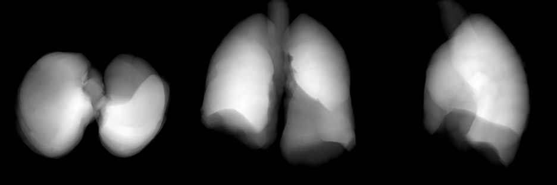
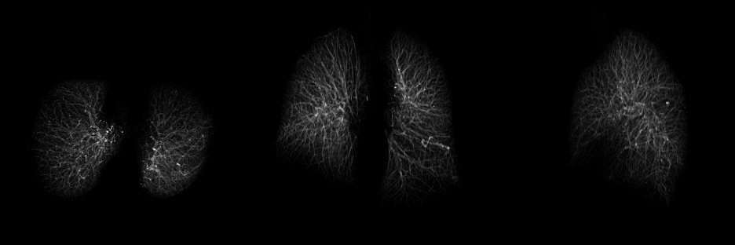
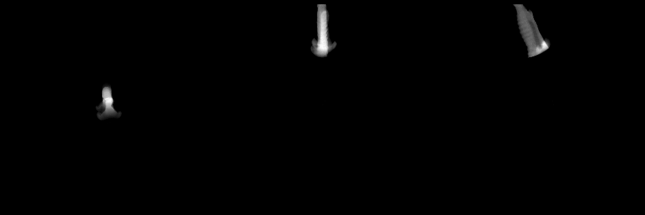
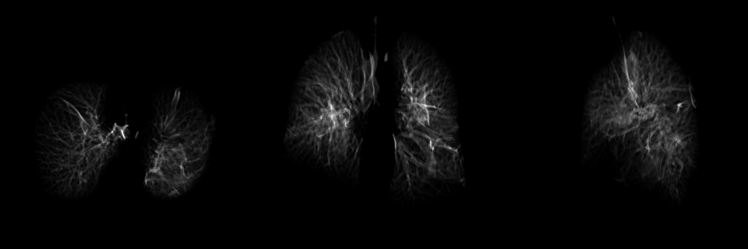

### frangi-filter


+ build and go into container.

```
bash build.sh

docker run -it -u $(id -u):$(id -g) -w /workdir -v $PWD:/workdir frangifilter bash
```


+ download and segment image using classical image processing methods.

```
python demo.py
```


### output images

lung mask:



vessel enhanced image:



airway enhanced image



fissure enhanced image  (pending param tweaking)



### observation

```
series_instance_uid = '1.3.6.1.4.1.14519.5.2.1.6279.6001.113679818447732724990336702075'

abnormal lung
with bright non-fissure plate like structures

left oblique fissure is present while right oblique and horizontal fissures seems to be incomplete/absent.

```
