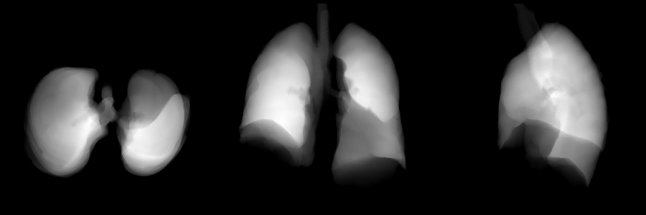
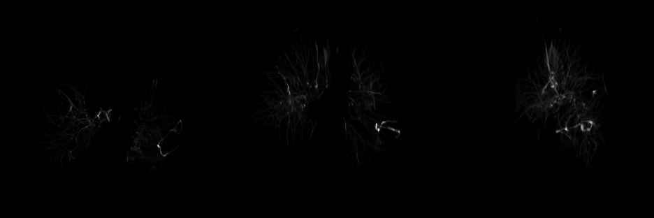
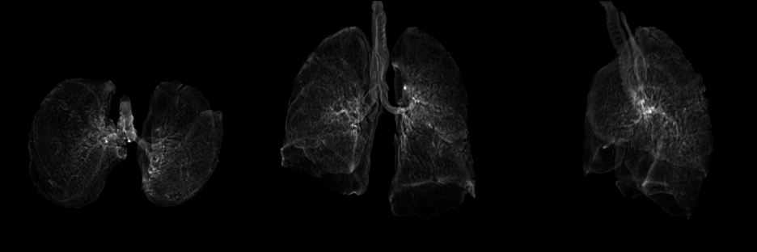

### frangifilter


```
 weekend homework to refresh my memory on the classic frangi filter.
```


+ build and go into container.

```
bash build.sh

docker run -it -u $(id -u):$(id -g) -w /workdir -v $PWD:/workdir frangifilter bash
```


+ download and segment image using classical image processing methods.

```
python demo.py
```


### output images

lung mask:



vessel enhanced image:


fissure enhanced image  (pending param tweaking)



airway enhanced image (pending param tweaking)



